  I build products that feel sharp, responsive, and a little bit unexpected.

  <a href="#about">About</a> ·
  <a href="#signal">Signal</a> ·
  <a href="#stack">Stack</a> ·
  <a href="#connect">Connect</a>

## About

<strong>Open the console</strong>
 

name      : MaxasOP
mode      : building interactive, high-contrast experiences
focus     : frontend polish, systems thinking, and practical tooling
principle : UniqueNESS

## Signal

<table>
<tr>
<td width="50%">

### What I build

- Interfaces with motion and personality
- Systems that stay understandable under pressure
- Tools that reduce friction instead of adding it
- Code that is intentional, not decorative

</td>
<td width="50%">

### What I value

- Clarity over noise
- Structure over trend-chasing
- Performance with restraint
- Craft that holds up over time

</td>
</tr>
</table>

## Stack

<strong>Show the toolkit</strong>
 

- Frontend: React, Vue, HTML, CSS, interactive UI patterns
- Backend: Python, JavaScript, C++
- Data: SQL, MongoDB, Firebase
- Systems: architecture, automation, cloud, performance
- Interests: finance, algorithms, data analysis

<strong>What I'm exploring now</strong>
 

- More expressive UI systems
- Better developer tooling
- Faster, leaner animation patterns
- Financial and data-heavy applications

## Live Stats

## Connect

